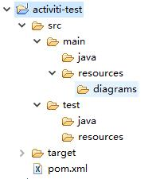
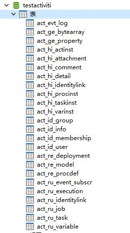

>这里完成activiti的第一个测试--利用ProcessEngine在mysql数据库中创建activiti的23张表。

本例代码下载[activiti-test.jar](https://github.com/jennyzhang8800/activiti-learn/blob/master/code/activiti-test.jar)

介绍两种方法：
+ 使用代码创建工作流需要的23张表
+ 使用配置文件创建工作流需要的23张表

## 使用代码创建工作流需要的23张表
### 1.创建一个activiti工程

`File-->new-->other-->activiti project`
工程名为:activiti-test

注意：只有安装了activiti-designer的情况下，才会有activiti project选项。

可以看到这个工程的目录结构。这其实maven项目。



### 2.导入jar包
+ 首先，在`activiti-test`工程下新建lib文件夹
+ 然后，把activiti的安装包下的`\activiti-5.17.0\wars\activiti-rest.war`解压，在解压后的'activiti-rest\WEB-INF\lib'目录下可以看到很多jar包，把这些包都复制到`activiti-test/lib`目录下。
+ 其次，把`mysql-connector-java-5.1.10-bin.jar`(可以到网上下载该jar)也复制到lib目录下。（因为'activiti-rest\WEB-INF\lib'下缺少这个连接mysql的包 ）
+ 最后，点eclipse右止角切换到java EE模式下（原来在activiti模式），接着选中该工程lib目录下所有的jar包-->右键'build path'-->'add to build path'

### 3. 写测试代码
+ 在`/src/test/java`下新建包，包名为junit
+ 在`/src/test/java/junit`包下新建类，类名为TestActiviti.java
+ 写测试代码如下：

```java
package junit;
import org.activiti.engine.ProcessEngine;
import org.activiti.engine.ProcessEngineConfiguration;
import org.junit.Test;

public class TestActiviti {
	/**使用代码创建工作流需要的23张表*/
	@Test
	public void createTable(){
		ProcessEngineConfiguration processEngineConfiguration=ProcessEngineConfiguration.createStandaloneProcessEngineConfiguration();
		//连接数据库的配置
		processEngineConfiguration.setJdbcDriver("com.mysql.jdbc.Driver");
		processEngineConfiguration.setJdbcUrl("jdbc:mysql://localhost:3306/testactiviti?useUnicode=true&characterEncoding=utf8");
		processEngineConfiguration.setJdbcUsername("root");
		processEngineConfiguration.setJdbcPassword("root");
		//没有表则创建表
		processEngineConfiguration.setDatabaseSchemaUpdate(ProcessEngineConfiguration.DB_SCHEMA_UPDATE_TRUE);
		//processEngine
		ProcessEngine processEngine = processEngineConfiguration.buildProcessEngine();
		System.out.println(processEngine);
	}
}
```

上述代码中采用的是使用代码创建工作流需要的23张表，使用的是`ProcessEngineConfiguration.createStandaloneProcessEngineConfiguration()`这是使用单例的方式创建

这里还有其它的创建方法：


后面还会介绍使用配置文件创建的方法（createProcessEngineConfigurationFromResource），现在我们先介绍使用代码创建工作流需要的表。

+ 先在mysql中新建数据库，名为"testactiviti"
+ 回到eclipse,运行createTable()单元测试，右键-->run as -->Junit

如果正常运行，则会在mymql中的testactiviti数据库中新建23张表。
控制台打印的信息如下：
```
03:30:52,441 [main] INFO  org.springframework.beans.factory.xml.XmlBeanDefinitionReader  - Loading XML bean definitions from class path resource [activiti.cfg.xml]
03:30:54,678 [main] INFO  org.activiti.engine.impl.db.DbSqlSession  - performing create on engine with resource org/activiti/db/create/activiti.mysql.create.engine.sql
03:30:54,679 [main] INFO  org.activiti.engine.impl.db.DbSqlSession  - Found MySQL: majorVersion=5 minorVersion=7
03:31:12,311 [main] INFO  org.activiti.engine.impl.db.DbSqlSession  - performing create on history with resource org/activiti/db/create/activiti.mysql.create.history.sql
03:31:12,312 [main] INFO  org.activiti.engine.impl.db.DbSqlSession  - Found MySQL: majorVersion=5 minorVersion=7
03:31:17,946 [main] INFO  org.activiti.engine.impl.db.DbSqlSession  - performing create on identity with resource org/activiti/db/create/activiti.mysql.create.identity.sql
03:31:17,947 [main] INFO  org.activiti.engine.impl.db.DbSqlSession  - Found MySQL: majorVersion=5 minorVersion=7
03:31:19,954 [main] INFO  org.activiti.engine.impl.ProcessEngineImpl  - ProcessEngine default created
org.activiti.engine.impl.ProcessEngineImpl@13526e59
```

同时，去mysql看，可以看到有如下的表：



至此，“使用代码创建工作流需要的23张表”己经完成。

接下来介始第二种方法，“使用配置文件创建工作流需要的23张表”

## 使用配置文件创建工作流需要的23张表

### 1. 创建配置文件

#### (1)在`activiti-test/src/main/resource/`下新建一个文件，名为activiti.cfg.xm文件，该xml的内容如下：
```xml
<?xml version="1.0" encoding="UTF-8"?>
<beans xmlns="http://www.springframework.org/schema/beans" xmlns:xsi="http://www.w3.org/2001/XMLSchema-instance"
  xmlns:context="http://www.springframework.org/schema/context" xmlns:tx="http://www.springframework.org/schema/tx"
  xmlns:jee="http://www.springframework.org/schema/jee" xmlns:aop="http://www.springframework.org/schema/aop"
  xsi:schemaLocation="http://www.springframework.org/schema/beans http://www.springframework.org/schema/beans/spring-beans-3.0.xsd
       http://www.springframework.org/schema/context http://www.springframework.org/schema/context/spring-context-3.0.xsd
       http://www.springframework.org/schema/tx http://www.springframework.org/schema/tx/spring-tx-3.0.xsd
       http://www.springframework.org/schema/jee http://www.springframework.org/schema/jee/spring-jee-3.0.xsd
       http://www.springframework.org/schema/aop http://www.springframework.org/schema/aop/spring-aop-3.0.xsd">
       

	<bean id="processEngineConfiguration" class="org.activiti.engine.impl.cfg.StandaloneProcessEngineConfiguration">
	<!-- 连接数据库的配置 -->
		<property name="jdbcDriver" value="com.mysql.jdbc.Driver" />
		<property name="jdbcUrl" value="jdbc:mysql://localhost:3306/testactiviti?useUnicode=true&amp;characterEncoding=utf8" />
		<property name="jdbcUsername" value="root" />
		<property name="jdbcPassword" value="root" />
		<property name="databaseSchemaUpdate" value="true" />
	
	</bean>
	
</beans>
```

这是一个spring的配置文件，`<bean></bean>`中的内容的效果，等同于上面的单元测试createTable()，中的
```java
	ProcessEngineConfiguration processEngineConfiguration=ProcessEngineConfiguration.createStandaloneProcessEngineConfiguration();
		//连接数据库的配置
		processEngineConfiguration.setJdbcDriver("com.mysql.jdbc.Driver");
		processEngineConfiguration.setJdbcUrl("jdbc:mysql://localhost:3306/testactiviti?useUnicode=true&characterEncoding=utf8");
		processEngineConfiguration.setJdbcUsername("root");
		processEngineConfiguration.setJdbcPassword("root");
		//没有表则创建表
		processEngineConfiguration.setDatabaseSchemaUpdate(ProcessEngineConfiguration.DB_SCHEMA_UPDATE_TRUE);
```
	

#### (2)紧接着上面的TestActiviti.java文件中，再写一个单元测试。

```java
	/**使用配置文件创建工作流需要的23张表*/
	@Test
	public void createTable_conf(){
		ProcessEngineConfiguration processEngineConfiguration=ProcessEngineConfiguration.createProcessEngineConfigurationFromResource("activiti.cfg.xml");
		//processEngine
		ProcessEngine processEngine = processEngineConfiguration.buildProcessEngine();
		System.out.println(processEngine);
	}
```

运行这个单元测试，是一样的效果。
