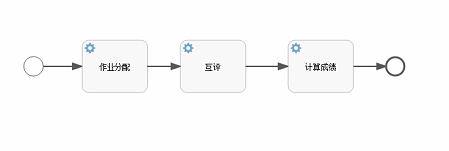
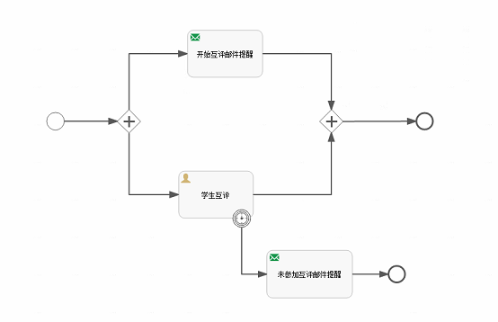
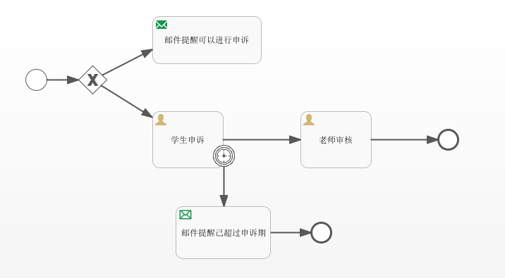

一个互评题，当教师进行“题目配置”时，有以下两种流程可供选择
## 1. 不允许学生申诉的流程

* 流程启动条件：当凑够提交作业人数时，如果该题配置为不允许学生申诉，则启动该流程。
* 流程启动后，进入“作业分配”活动。这个活动进行作业分配（distributeTask）作业分配结束后，进入到下一个活动“互评”。
* “互评”活动：会调用子流程，该活动会跟据从上一个活动中传递过来的的作业分配结果，启动子流程（为每一个参与互评的用户启动“互评”子流程）。“互评”子流程结束后，进入到下一个活动。
* “计算成绩”：根据互评结果，计算成绩。
*  流程结束：所有人的成绩计算出之后，本次互评流程结束。

其中“互评”子流程的流程图如下：

* 流程启动条件：由上面“互评”活动调用启动
* 启动该流程之后，进入到“学生互评”用户任务，该任务的办理人为参与互评的某个学生。同时还会给该办理人发送邮件。
* 流程结束：
    + 当“学生互评”用户任务被其办理人按时完成时流程结束
    + 当“学生互评”用户任务的办理人超时未完成时，进入到“未参加互评邮件提醒”活动，然后流程结束
    
    
## 1. 允许学生申诉的流程

* 流程启动条件：当凑够提交作业人数时，如果该题配置为允许学生申诉，则启动该流程。
* 流程启动后，进入“作业分配”活动。这个活动进行作业分配（distributeTask）作业分配结束后，进入到下一个活动“互评”。
* “互评”活动：会调用子流程，该活动会跟据从上一个活动中传递过来的的作业分配结果，启动子流程（为每一个参与互评的用户启动“互评”子流程）。“互评”子流程结束后，进入到下一个活动。
* “计算成绩”：根据互评结果，计算成绩。
* “审核成绩”：当“计算成绩”活动结束后，进入到该活动。该活动会启动“成绩审核”子流程，为每一个参与互评的用户启动“成绩审核”子流程
*  流程结束：所有“成绩审核”子流程结束后，本次互评流程结束。

其中“成绩审核”子流程的流程图如下：

* 流程启动条件：由上面“审核成绩”活动调用启动
* 启动该流程之后，进入到“学生”用户任务，该任务的办理人为参与互评某个的学生。同时还会给该办理人发送邮件。
* 流程结束：
    + 当“学生互评”用户任务被其办理人按时完成时，进入到下一个“老师审核”任务，该任务办理人为“教师”角色。当“老师审核”任务完成之后，流程结束。
    + 当“学生互评”用户任务的办理人超时未完成时，进入到“未参加互评邮件提醒”活动，然后流程结束
    